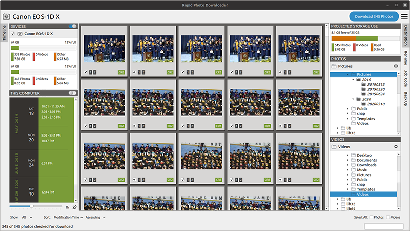

# Rapid Photo Downloader

Rapid Photo Downloader is a Linux desktop application that imports photos and videos from cameras,
phones, memory cards, and other devices at high speed. It is written by a 
[photographer](https://damonlynch.net) for professional and amateur photographers.



## Features

 - Rename photos and videos with meaningful filenames you specify.
 - Download vast numbers of photos and videos with minimum fuss.
 - Back up photos and videos as they are downloaded.
 - Downloads from and backs up to multiple devices simultaneously.
 - Easy to configure and use.
 - Configure program preferences without the need for complicated codes.
 - Automate common tasks, such as unmounting a memory card when the download is complete.

[Read more about its features at the program website](https://damonlynch.net/rapid/features.html).

  
## Documentation

[Full documentation is available at the program website](https://damonlynch.net/rapid/documentation/).


## Program Design

Rapid Photo Downloader is coded in Python.
To get the best performance using Python on modern multi-core computers, the program uses multiple 
OS-level processes that communicate with each other using the messaging library 
[0MQ](https://zeromq.org/).

[Learn more about the program's architecture](https://damonlynch.net/rapid/design.html).
  

## Issue Reporting

Report new issues on the
[developer's GitHub repository](https://github.com/damonlynch/rapid-photo-downloader/issues).

Historic issues are at the previous code repository,
[Launchpad](https://bugs.launchpad.net/rapid). 


## Installation

Rapid Photo Downloader is packaged by all major Linux distributions. 
If you want the latest version, or prefer it run with all its features enabled 
(like [heif](https://en.wikipedia.org/wiki/High_Efficiency_Image_File_Format) support), 
you can run the `install.py` script:


### Ubuntu, openSUSE, Debian, Fedora, and CentOS 8

To install Rapid Photo Downloader, run as your regular user (i.e. without sudo):

```bash
  python3 install.py
```

This script will install packages from your Linux distribution and from the 
[Python Package Index (PyPi)](https://pypi.org/).
The program sudo may prompt for your administrator (root) password during the install process, if 
required.

For a list of optional commands you can give the insaller, run:

```bash
  python3 install.py --help
```

Finally, to uninstall:

```bash
  python3 install.py --uninstall
```

Or to uninstall both the program and its Python package dependencies:

```bash
  python3 install.py --uninstall-including-pip-dependencies
```


### CentOS 7.5

To install on CentOS 7.5, first install Python 3.6 from the IUS Community repository:

```bash
  sudo yum -y install yum-utils

  sudo yum -y install https://centos7.iuscommunity.org/ius-release.rpm

  sudo yum -y install python36u python36u-setuptools
```

Then run the install.py script:
```bash
  python3.6 install.py
```


### Supported Linux Versions

 - Ubuntu 18.04 or newer
 - LinuxMint 19 or newer
 - Debian 9, unstable or testing
 - Fedora 33 or newer
 - openSUSE Leap 15.3 or newer
 - CentOS 7.5 or 8
 - Any distribution meeting the software requirements below


### Software Requirements

 - Python 3.6 or newer, and its development headers
 - [PyQt 5](https://riverbankcomputing.com/software/pyqt/intro)
 - [Qt 5](https://www.qt.io/)
 - [Qt5 plugin for reading TIFF images](http://doc.qt.io/qt-5/qtimageformats-index.html)
 - Qt5 plugin for rendering SVG
 - [setuptools](https://pypi.org/project/setuptools/)
 - [python-gphoto2 1.4.0](https://github.com/jim-easterbrook/python-gphoto2) or newer
 - [show-in-file-manager 1.1.1](https://github.com/damonlynch/showinfilemanager) or newer
 - [importlib_metadata](https://github.com/python/importlib_metadata) on Python versions older than 3.8
 - [pyzmq](https://github.com/zeromq/pyzmq)
 - [tornado](http://www.tornadoweb.org/)
 - [psutil](https://github.com/giampaolo/psutil) 3.4.2 or newer
 - [pyxdg](https://www.freedesktop.org/wiki/Software/pyxdg/)
 - [Arrow](https://github.com/crsmithdev/arrow)
 - [dateutil](https://labix.org/python-dateutil) 2.2 or newer
 - [exiv2](http://www.exiv2.org/)
 - [ExifTool](http://www.sno.phy.queensu.ca/~phil/exiftool/)
 - [EasyGUI](https://github.com/robertlugg/easygui)  
 - [Colour](https://github.com/vaab/colour)
 - [pymediainfo](https://github.com/sbraz/pymediainfo)
 - [SortedContainers](http://www.grantjenks.com/docs/sortedcontainers/)
 - [Requests](http://docs.python-requests.org/)
 - [Tenacity](https://github.com/jd/tenacity)
 - [intltool](https://freedesktop.org/wiki/Software/intltool/)
 - [Babel](http://babel.pocoo.org/en/latest/)
 - [Python gobject introspection modules](https://wiki.gnome.org/action/show/Projects/PyGObject):
    - GUdev 1.0
    - UDisks 2.0
    - GLib 2.0
    - GExiv2 0.10
    - Gst 1.0
    - Notify 0.7
        
Highly recommended, optional dependencies:

 - [colorlog](https://github.com/borntyping/python-colorlog): generates coloured program output when
   running Rapid Photo Downloader from the terminal.
 - [pyprind](https://github.com/rasbt/pyprind): shows a progress bar on the command line while 
   running the program analyze_pv_structure.
 - [pyheif](https://github.com/david-poirier-csn/pyheif): open HEIF / HEIC files
 - [pillow](https://github.com/python-pillow/Pillow): work with HEIF / HEIC files


### Installation into a Python Virtual Environment

Rapid Photo Downloader can be installed into a virtual environment,
allowing you to isolate the Python packages it needs from other programs
on your system.

Virtual environments created with the `--system-site-packages` option are
not supported. An Intel or AMD 64 bit platform is required.

To install Rapid Photo Downloader into a Python virtual environment,
create the virtual environment (naming it whatever you like):

```bash
  python3 -m venv myenv
```

Activate the virtual environment:

```bash
  source myenv/bin/activate
```

Then run the installer, passing the command line option telling the
script to install Rapid Photo Downloader into the virtual environment:

```bash
  python install.py --virtual-env
```

Once installed, you can then deactivate the virtual
environment with the deactivate command:

```bash
  deactivate
```

Rapid Photo Downloader can be started without activating the virtual
environment by running

```bash
  myenv/bin/rapid-photo-downloader
```

To uninstall from the virtual environment, simply delete the virtual
environment\'s directory.


## License

[GPL3 or later](https://choosealicense.com/licenses/gpl-3.0/).

  